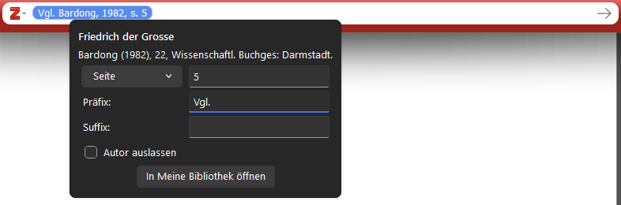
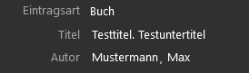
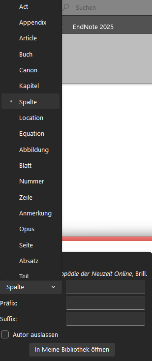
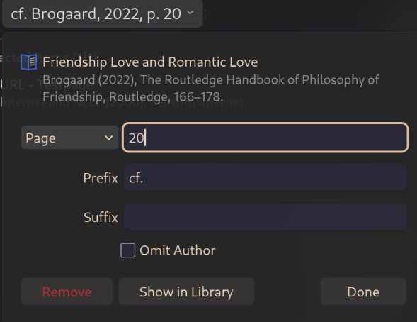
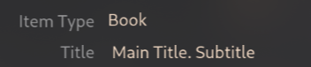
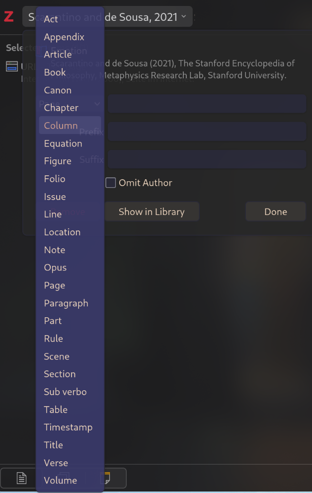

# Zitierstil - Vademekum - Dokumentation

[Installation](install.md)

English Version [below](#citation-style---vademekum---documentation)

## Allgemeines

- Wenn bei einer neuen Seite die erste Zitation identisch mit der letzten Zitation auf der vorherigen Seite ist, wird trotzdem mit "Ebd." fortgesetzt und nicht mit der Kurzzitation. Daher sollte am Ender der Arbeit nochmal überprüft werden, ob nach jedem Seitenumbruch die korrekte Zitation an erster Stelle steht. 
- Um Seitenzahlen und den Präfix "Vgl." vor der Zitation einzufügen, kann durch klick auf die Zitation in der Zitationsauswahl die Seitenzahl und der Präfix angegeben werden

## Notwendige Felder bei allen Eintragsarten

- Autor (Name, Vorname)
- Titel
	- Trennung von Titel und Untertitel durch "." muss im Feld "Titel" innerhalb von Zotero manuell vorgenommen  werden 

### Monographien/Dissertationen (Buch/Dissertation)

- Ort
- Verlag
- Datum

### Aufsätze in Zeitschriften (Zeitschriftenartikel)

- Publikation
- Band
- Ausgabe
- Datum
- Seiten

### Aufsätze in Sammelbänden (Buchteil)

- Herausgeber
- Buchtitel
- Ort
- Verlag
- Seiten

### Lexikonartikel (Enzyklopädieartikel) Online / Physisch

- Titel der Enzyklopädie
- Datum
- DOI oder Link
	- DOI oder Link darf nur für die Onlinevariante gefüllt sein - Bei physischem Eintrag müssen die Felder *leer* sein.
- Um bei physischer Version die Abkürzung für "Spalten" zu bekommen, kann beim Einfügen der Zitation durch klick auf das "Seite" Feld, "Spalte" im Drop-Down Menü ausgewählt werden.
	- **Im Literaturverzeichnis wird trotzdem "S." angezeigt. Dies muss manuell angepasst werden**

### Zeitungen (Zeitungsartikel)

- Publikation
- Datum
- Heruntergeladen am
- Seiten oder URL
	- Auch hier muss das Feld "URL" *leer* sein, damit der physische Eintrag korrekt funktioniert

### Internetseiten (Webseite)

- Titel der Website
- Datum
- Heruntergeladen am
- URL oder DOI

# Citation Style - Vademekum - Documentation

[Installation](install.md)

## General

- If the first citation on a new page is identical to the last citation on the previous page, the text should still continue with “Ibid.” rather than the short citation. Therefore, you should double-check at the end of your paper to ensure that the correct citation appears first after every page break. 
- To insert page numbers and the prefix “Cf.” before the citation, click on the citation in the citation selection to specify the page number and the prefix.

## Required Fields for all Entry Types

- Author (last name, first name)
- Title
	- The “.” must be manually added to separate the title and subtitle in the “Title” field within Zotero

### Monographs/Thesis (Book/Thesis)

- Place
- Publisher
- Date

### Journal Articles (Journal)

- Publication
- Volume
- Issue
- Date
- Pages

### Articles in Edited Volumes (Book Section)

- Editor
- Book Title
- Place
- Publisher
- Pages

### Encyclopaedia Articles (Encyclopedia Article) Online / Physical

- Encyclopedia Title
- Date
- DOI or Link
	- The DOI or link field may only be filled in for the online version — for physical entries, these fields must be *left blank*.
- To display the abbreviation for “columns” in the physical version, click the ‘Page’ field when inserting the citation and select “Column” from the drop-down menu.
	- **“p.” still appears in the bibliography. This must be corrected manually.**

### Newspaper (Newspaper Article)

- Publication
- Date
- Accessed
- Pages or URL
	- Here, too, the “URL” field must be *empty* for the physical entry to work correctly

### Internet Pages that are not in Journal Format (Web Page)

- Website Title
- Date
- Accessed
- URL or DOI
