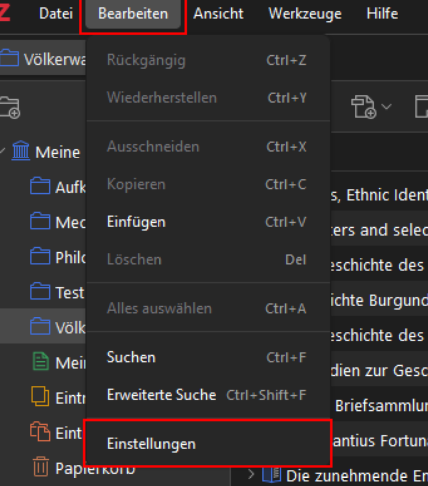
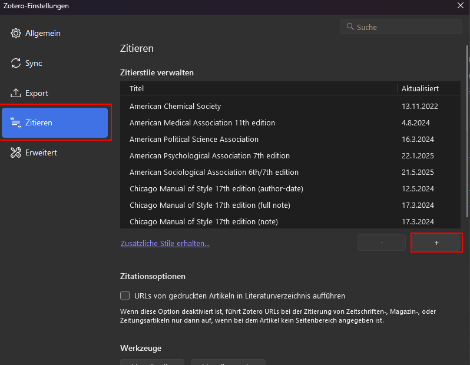
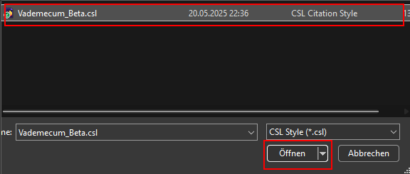
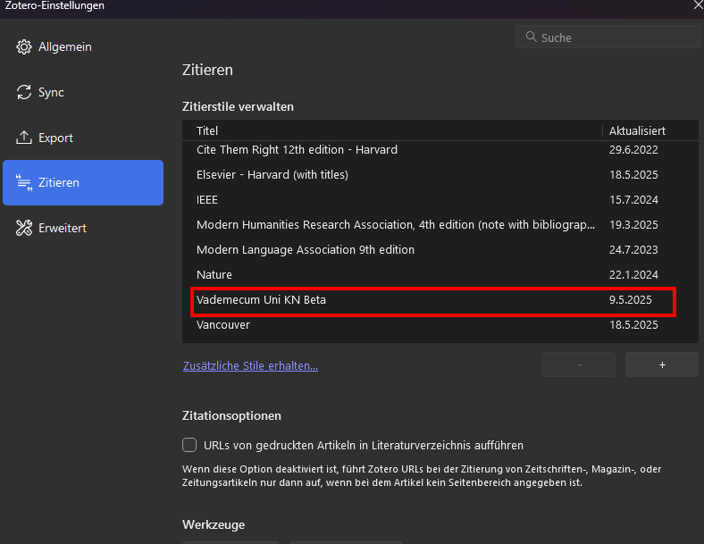
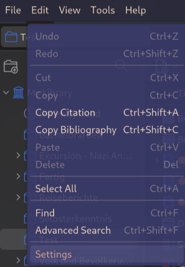
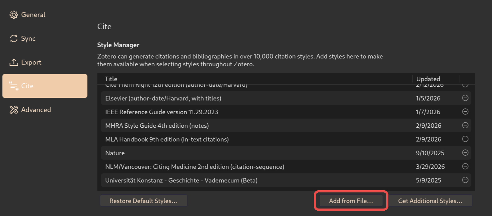
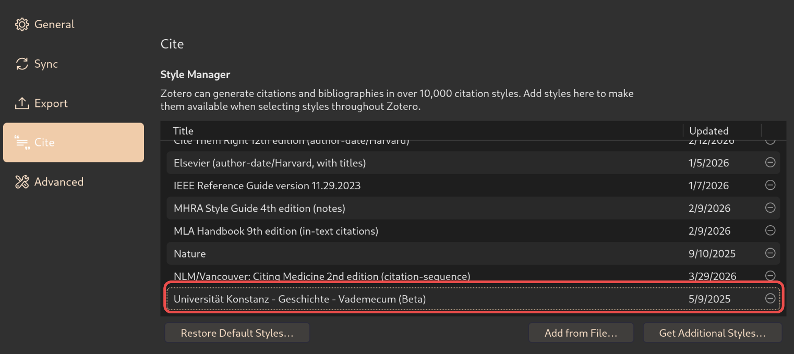

# Zitierstil in Zotero einfügen

[Documentation](documentation.md)

English Version [below](#add-a-citation-style-to-zotero)

## Schritt 1

- Schaltfläche bearbeiten drücken
- Einstellungen auswählen

## Schritt 2

- Unter Reiter "Zitieren" auf das "+" Symbol klicken

## Schritt 3

- .csl Datei nach [Download](/src/Vademecum_Beta_V1-0-2.csl) auswählen und auf "öffnen" klicken

## Schritt 4

- Zitierstil sollte nun unter "Zitieren" -> "Zitierstil verwalten" auftauchen und in Word/Libre Writer ausgewählt werden können

# Add a Citation Style to Zotero

[Documentation](documentation.md)

## Step 1

- Select "Edit" -> "Settings"

## Step 2

- On the “Cite” tab, click the “Add from File...” button

## Step 3

- Select the .csl File that you can download [here](/src/Vademecum_Beta_V1-0-2.csl)

## Step 4

- The citation style should now appear under “Citations” -> “Style Manager” and be selectable in Word/Libre Writer

